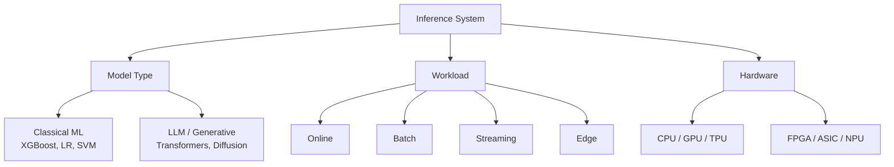
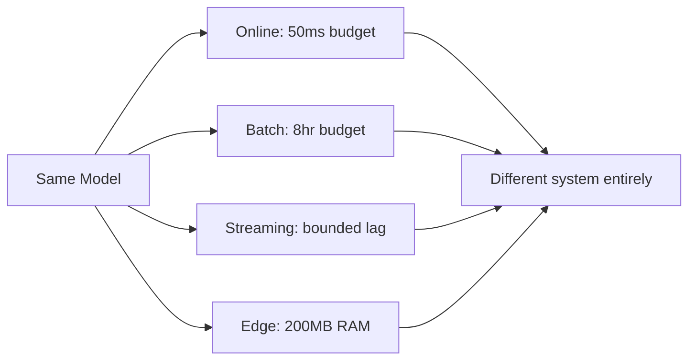
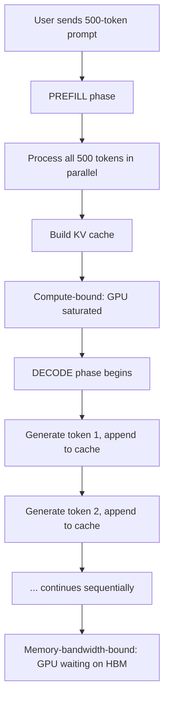
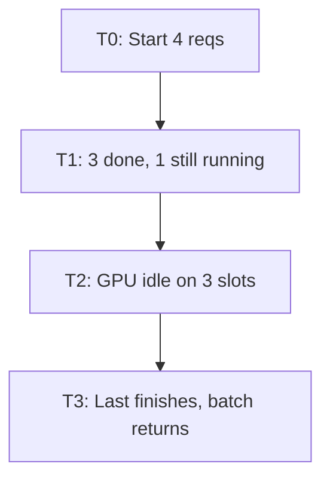
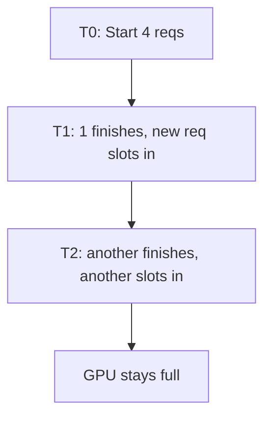
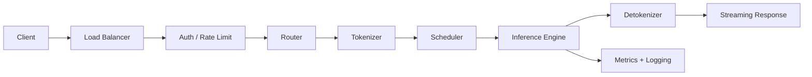

# Inference Pipelines: Guide for ML and AI Systems

Training gets the headlines. Inference pays the bills.

Once a model leaves the notebook, the engineering problem changes completely. We start asking "can this serve 50,000 requests per second at p99 < 200ms without melting the GPU budget?".

This post is a structured map of how production inference works, from a fraud-scoring XGBoost model running on CPU to a 70B-parameter LLM serving streaming tokens across a GPU cluster. It's the reference doc I wish existed when I started looking into this seriously.


## How to read this guide


> Every inference system is a point in a 3D space defined by **model type × workload × hardware**. Every optimization technique such as quantization, batching, caching, MoE is a tool we apply to move within that space.





## Foundations

### What is Inference

Training is the process of fitting parameters to data. Inference is everything that happens after, taking those frozen parameters and using them to produce predictions on new inputs.

The asymmetry is the whole point: you train a model once (or a few times). You serve it billions of times. At any AI-first company, inference is now the dominant line item in the compute budget and at most large enterprises running classical ML, the *aggregate* serving cost across thousands of small models sometimes exceeds training spend by an order of magnitude.

### The four metrics you negotiate

Every design decision trades among four things:

| Metric | What it measures | Where it bites |
|---|---|---|
| **Latency** | Time per request (p50, p99, TTFT, TPOT) | User experience, SLAs |
| **Throughput** | Requests or tokens per second | Capacity, infra cost |
| **Cost** | $ per million predictions or tokens | Margins, viability |
| **Quality** | Accuracy, task success, hallucination rate | Whether the product works |

We cannot maximize all four. Quantization trades quality for cost and latency. Bigger batches trade latency for throughput. A larger model trades cost for quality. The job is picking which tradeoffs we need.

A useful rule of thumb: **figure out the binding constraint first.** A real-time fraud model might have a hard 50ms ceiling, here latency is the constraint, optimize everything else around it. A nightly batch job has 8 hours, here throughput-per-dollar wins. A consumer chatbot has both a TTFT (Time to First Token) budget and a margin target, that's why it's hard.


## Workload Types

### Online (real-time)

Request comes in, response goes out, ideally in milliseconds. Single request or small batch. This is most user-facing inference.

- **Examples:** fraud scoring on a card swipe, search ranking, ad CTR prediction, a chatbot turn, real-time price prediction.
- **Constraint:** latency, especially tail latency (p99). Averages lie, what kills you is the slow 1% of requests.

### Batch

Score huge datasets offline on a schedule. Latency per record doesn't matter, total wall-clock and cost do.

- **Examples:** nightly recommendation refresh at Netflix, bulk embedding of a document corpus, end-of-day risk recalculation, backfilling features for a new model.
- **Constraint:** throughput per dollar. You're optimizing a Spark or Ray job, not a server.

### Streaming

Continuous event flow like Kafka, Flink, Pub/Sub with models scoring events as they arrive. Sits between online and batch: not request/response, but not nightly either.

- **Examples:** live transaction anomaly detection at a payments firm, real-time alpha signal generation from market tick data, fraud rules running against an event bus.
- **Constraint:** sustained throughput with bounded end-to-end lag.

### Edge / on-device

Model that runs locally on phone, browser, in-car system, IoT device. No network round-trip, but tight memory and battery limits.

- **Examples:** Face ID, on-device translation, llama.cpp running a 7B model on a MacBook, voice wake-word detection.
- **Constraint:** model size and energy. A 3GB model is a lot on a phone.



The point of this diagram: the same model can power four different systems, and the engineering looks nothing alike across them.


## Hardware

You do not need to be a chip designer to deploy machine learning models. You just need to know what problem each physical chip solves and when to pick it.

### CPUs
**What bottleneck it solves:** The data transfer penalty. GPUs are incredibly fast at math, but physically sending tiny amounts of data to a GPU takes longer than just letting the standard computer processor do the math itself.
**When to use it:** Use CPUs for classical machine learning like linear regressions, XGBoost, or random forests. If your model is small and your input is tabular data, a standard CPU is almost always the fastest and cheapest option.

### GPUs
**What bottleneck it solves:** Massive parallel multiplication. Deep learning requires millions of simultaneous calculations. GPUs handle this effortlessly, provided they have enough memory (VRAM) to hold the actual model weights.
**When to use it:** Use GPUs for Deep Learning and Large Language Models. If your model exceeds a few gigabytes, a GPU is mandatory. Remember: the primary constraint here is memory bandwidth (how fast the chip can fetch data), not calculator speed.

### TPUs
**What bottleneck it solves:** Efficiency at massive cloud scale. Google designed these chips to do one specific type of math (dense matrix multiplication) faster and with less electricity than generic GPUs.
**When to use it:** Use TPUs if you are running massive batches of data entirely inside the Google ecosystem and want incredible throughput per dollar.

### FPGAs
**What bottleneck it solves:** Operating system delays and network jitter. You physically rewire the circuits yourself, entirely bypassing the unpredictable delays of standard software.
**When to use it:** Use FPGAs if you are a High Frequency Trader where a microsecond delay costs millions of dollars. They are brutally difficult to program but offer the absolute lowest latency floor mathematically possible.

### Inference ASICs
**What bottleneck it solves:** The "jack of all trades" slowdown. Chips like Groq LPU give up the ability to do general computing in exchange for holding memory directly next to the processor, resulting in unbelievable execution speeds.
**When to use it:** Use ASICs when you need extreme performance for a very specific isolated task, like running an AI chatbot where instantly generating tokens is your core business model.

### NPUs
**What bottleneck it solves:** Mobile battery drain. Running complex AI models on a phone processor would drain the battery instantly. NPUs process AI math using highly restricted energy budgets.
**When to use it:** Use NPUs when building apps that run locally on mobile devices, like Apple Face ID or offline language translation.

### Picking hardware (A simple heuristic)

```python
def pick_hardware(model_type, model_size_gb, speed_requirement):
    if speed_requirement == "microseconds":
        return "FPGA or specialized ASIC"
    if model_type == "tree_based" and model_size_gb < 5:
        return "CPU (Keep it simple)"
    if model_type == "llm" and model_size_gb > 40:
        return "Multi GPU Cluster"
    if model_type == "llm":
        return "Single Modern GPU"
    return "GPU if it fits strictly in VRAM, else CPU"
```

This is rough, the real decision involves ecosystem maturity, ops familiarity, and what your cloud provider charges you on a random Tuesday.


## Classical ML Inference

Before LLMs ate the discourse, this was 95% of production ML. It still is at most non-tech and tech companies like the fraud model approving your card swipe, the credit model on your loan application, the demand forecast for tomorrow's inventory.

### What counts as classical ML

Tree ensembles (XGBoost, LightGBM, CatBoost), linear and logistic regression, SVMs, classical NLP pipelines (TF-IDF + logistic regression), shallow neural nets. Cheap to serve, fast to retrain, and critically **explainable**. When a regulator asks why a loan was denied, "feature 47 had SHAP value -0.23" is an answer. "The transformer felt strongly about it" is not.

### The serving stack


The *model* part is rarely the hard part. The hard part is everything around it.

### Feature pipelines and the skew problem

This is the bug that ruins more ML systems than any other.

You train your model on features computed in a Spark job over historical data. You serve it with features computed in a Python service in real time. Six months later, accuracy quietly degrades and nobody knows why. Reason: the two pipelines drifted apart. Maybe the online version uses a 30-day rolling average where training used 28 days. Maybe a timezone is off. Maybe a join is slightly different.

This is **training-serving skew**, and the solution is a feature store with shared computation logic and **point-in-time correctness**. When you generate training data, every feature value reflects what was knowable *at that exact historical moment*, not what's known today.

A concrete fintech example: you're training a fraud model on transactions from January 2024. The feature `customer_30d_avg_txn_amount` should reflect the customer's average from December 2023, not their average over all of 2024. Get this wrong and you train on labels that leak the future, get 99% AUC in offline eval, and watch it crater to 60% in production. This bug is so common it has a name (label leakage) and an entire category of tooling (Feast, Tecton) built to prevent it.

### Serving frameworks

FastAPI for simple stuff, BentoML and Seldon for more structure, KServe on Kubernetes, SageMaker / Vertex AI / Azure ML for managed paths, NVIDIA Triton when you want one server handling many model types.

### Where classical ML still wins

- **Hard latency floors.** Fraud scoring with a 50ms budget. An LLM call won't fit.
- **Regulated decisions.** Credit, insurance, healthcare. Explainability is a legal requirement.
- **Tabular data.** GBMs still beat neural nets on most tabular problems.
- **Cost.** A logistic regression costs ~nothing per call. An LLM is meaningfully expensive.

Not everything needs a transformer. Most things still don't.


## LLM and Generative Inference

This is where the new complexity lives, and where the cost optimization money is in 2026 and upcoming years. Worth slowing down for.

### Why it's fundamentally different

Classical models are **one-shot**: input → forward pass → output. Done.

LLMs are **autoregressive**: they generate one token at a time, and each new token requires running the model again over the full sequence so far.

```python
def generate(prompt, model, max_tokens=200):
    sequence = tokenize(prompt)
    for _ in range(max_tokens):
        # Run the entire model. Again. For one token.
        logits = model.forward(sequence)
        next_token = sample(logits[-1])
        sequence.append(next_token)
        if next_token == EOS:
            break
    return detokenize(sequence)
```

A "single request" is actually hundreds of forward passes. This single fact reshapes everything about how you serve these models.

### The math: where the cost actually goes

Every transformer forward pass is dominated by matrix multiplications. For a sequence of length `n`, hidden dimension `d`, and `L` layers, you're doing roughly:

- **Attention:** O(n² · d) per layer — every token attends to every previous token
- **Feed-forward:** O(n · d²) per layer — the dense projections
- **Total per forward pass:** O(L · (n² · d + n · d²))

Plug in real numbers for a 70B model: `L ≈ 80`, `d ≈ 8192`, and a 4K-token context. You're looking at hundreds of teraflops *per generated token*. Multiply by a few hundred tokens of output. Multiply by thousands of concurrent users. The scale is the problem.

Worse, during decoding most of that compute is **memory-bandwidth-bound**, not compute-bound. The GPU isn't busy multiplying — it's waiting for weights to stream in from HBM. A H100 has ~3 TB/s of memory bandwidth and ~2,000 TFLOPS of FP16 compute. For a 70B model in FP16 (140GB of weights), naively reading every weight once per token caps you at about 20 tokens/sec on a single GPU. That's the theoretical ceiling — and it's a bandwidth ceiling, not a compute one.

This is why every LLM optimization either (a) reduces how many bytes you move per token, or (b) generates multiple tokens per memory pass. Keeping this frame in mind as it will explain everything that follows.

### The KV cache

To generate token N+1, the model needs the attention keys and values for tokens 1 through N. Recomputing them every step would be quadratic and absurd. So we cache them.

The cache grows with sequence length, batch size, layers, and hidden dimension:

```
KV cache size ≈ 2 × batch × seq_len × num_layers × hidden_dim × bytes_per_element
```

For a 70B model in FP16 with a 4K context and batch size 16, that's roughly **40+ GB of KV cache alone**, on top of the 140GB of weights. This is why long-context inference is hard, the cache in fact, not the weights, becomes the binding memory constraint.

### Prefill vs. decode

This split is the most important conceptual idea in modern LLM serving. Internalize it and everything else clicks.

**Prefill:** processing the input prompt. You have all N input tokens at once, you can compute their representations in parallel. Compute-bound, the GPU is saturated.

**Decode:** generating output tokens one at a time. Each step processes a single new token against the cached context. Memory-bandwidth-bound, the GPU is mostly waiting on memory.



Two completely different workloads in one request. They have different bottlenecks and different optimal hardware configurations. The current production frontier is called **disaggregated serving** which runs prefill and decode on separate GPU pools precisely because they're different problems.

### Continuous batching

Old way (static batching): collect requests into a batch of 8, run them together, wait for the longest one to finish, return all 8, start the next batch. Result: GPU sits idle while one slow request blocks seven fast ones.

New way (continuous / in-flight batching): the scheduler operates at the token level. As soon as one request finishes, a new one slots into its place, **mid-batch**. The GPU stays full.

**Static Batching (old)**


**Continuous Batching (new)**


This was a ~10x throughput win when vLLM popularized it. Single biggest serving improvement of the last few years.

### Paged attention

vLLM's other contribution. The KV cache used to be allocated as one contiguous block per request which was sized for the worst case, which meant huge memory waste from internal fragmentation.

Paged attention borrows the OS virtual-memory trick: split the cache into fixed-size pages, allocate pages on demand, share pages across requests when prefixes overlap. Memory utilization jumps from ~40% to ~95%. More requests fit on the same GPU.

### Speculative decoding

Use a small "draft" model to predict the next K tokens cheaply. Run the big model once to verify all K predictions in parallel. If the draft was right about the first M tokens, you've generated M tokens for the cost of one big-model forward pass.

This works because verification is parallel (compute-bound, where the GPU has spare capacity) while normal decoding is sequential (memory-bound, where it doesn't). You're trading idle compute for fewer memory reads. EAGLE, Medusa, and lookahead decoding are variants of this idea.

### Disaggregated serving

If prefill is compute-bound and decode is memory-bound, why run them on the same GPU? Disaggregated serving puts prefill on one pool of GPUs and decode on another, connected by fast networking that ships the KV cache between them. Each pool gets sized and tuned for its actual bottleneck. This is where the frontier of LLM serving sits in 2026.

### Long context

A 1M-token context window doesn't come for free. Attention is O(n²), so going from 4K to 1M is a 60,000× compute increase for the attention layer if you do it naively. The fixes — sliding window attention, attention sinks, ring attention, chunked prefill — are all variations on "don't actually attend over everything densely."

### Engines worth knowing

| Engine | Where it shines |
|---|---|
| **vLLM** | Open-source default. Great Python ergonomics, paged attention, broad model support. |
| **TensorRT-LLM** | NVIDIA's optimized engine. Faster on NVIDIA hardware, more setup pain. |
| **SGLang** | Strong on structured generation and complex prompting patterns. |
| **TGI** | HuggingFace's serving stack. Solid, integrated with the HF ecosystem. |
| **llama.cpp** | The edge/local king. Quantized inference on CPUs and Apple Silicon. |


## Optimization Techniques

These cut across model types and hardware. Quantization helps both XGBoost and Llama; batching helps all of them. 

### Quantization

Models are usually trained in FP32 (32-bit floats). Inference doesn't need that precision. You can drop down to FP16, BF16, FP8, INT8, INT4 and with each step, you halve memory and roughly double bandwidth-bound throughput.

The lever: lower precision means fewer bytes per weight, which means more weights fit in cache, less data crosses HBM, and the GPU spends more time computing instead of waiting.

- **PTQ (post-training quantization):** quantize a trained model directly. Fast, no retraining. Sometimes loses accuracy.
- **QAT (quantization-aware training):** train *with* quantization in the loop. Better accuracy, more expensive.
- **For LLMs:** GPTQ, AWQ, GGUF are the production formats. INT4 is the current sweet spot for many open models, most of the quality, a quarter of the memory.

Where it breaks: extreme low-bit quantization (INT2 and below) on small models, or any quantization on already-fragile reasoning capabilities. Always benchmark on your task, not just on perplexity.

### Pruning

Zero out unused weights. Two flavors:

- **Structured:** remove whole heads, channels, or layers. Actually speeds up inference because the math is smaller.
- **Unstructured:** zero out individual weights. Looks great on paper (90% sparse!) but doesn't speed up inference unless you have sparse-aware hardware, because dense matmul kernels just multiply by zero anyway.

Structured pruning is the one that matters in production.

### Distillation

Train a small "student" model to imitate a big "teacher" model's outputs. The student is cheaper to serve and surprisingly close in quality. This is half the reason 7B models in 2026 are matching what 70B models did in 2023, they're trained on outputs from frontier models.

### Mixture of Experts (MoE)

Instead of one giant dense network, build N "expert" subnetworks and a router that picks the top-k for each token. A 600B-parameter MoE might activate only 30B parameters per token. You get the quality of a huge model at the compute cost of a small one.

Catch: you still pay the *memory* cost. All N experts have to be loaded somewhere. MoE serving is its own discipline such as expert parallelism, routing-aware batching, handling the long tail of rarely-activated experts.

### Caching

- **Prompt cache:** identical prompt? Skip the work entirely.
- **KV prefix cache:** if 1,000 requests share the same 2,000-token system prompt, compute its KV cache once and reuse it across all of them. Massive win for chatbots and agents.
- **Semantic cache:** embedding-based lookup. If a new query is semantically similar to one you've answered before, return the cached answer.
- **Feature cache (classical ML):** memoize expensive feature computations.

### Batching strategies

- **Static:** collect, run, return. Fine for batch jobs, bad for online.
- **Dynamic:** group requests that arrive within a small time window. The default for most non-LLM serving.
- **Continuous:** token-level scheduling for autoregressive models. Covered above.

### Parallelism for huge models

When the model doesn't fit on one GPU:

- **Tensor parallelism:** split each layer's matrices across GPUs. Heavy GPU-to-GPU communication, fastest for inference.
- **Pipeline parallelism:** put different layers on different GPUs. Less communication, but introduces pipeline bubbles.
- **Expert parallelism:** put different MoE experts on different GPUs.
- **Sequence parallelism:** split the sequence dimension. Helps with very long contexts.

Real systems combine these. A 70B model serving might use 4-way tensor parallel, a 600B MoE might use 8-way tensor + 8-way expert parallel.


## System Design of Production Inference

A model is not a system. So we need to build a system around it.

### The full request lifecycle



Every hop is a place latency hides. The scheduler queue is often the worst offender,under load, requests can wait 10x longer in line than they spend computing.

### Routing and multi-model serving

You rarely run one model. Patterns that come up:

- **LoRA adapters on a shared base.** Serve 50 fine-tuned variants of Llama from one set of weights — the adapters are tiny.
- **Cascade routing.** Try a cheap model first; if confidence is low or the task is hard, escalate to a bigger one. Cuts cost dramatically when most queries are easy.
- **Specialist routing.** Route code questions to a code model, math to a math model, general to a general model.

### Autoscaling

Cold starts are brutal for big models as much as they are for gas cars, loading 140GB of weights takes minutes. You can't scale-from-zero a 70B model the way you scale a stateless web service. Standard patterns: minimum warm replica pool, predictive pre-warming on traffic patterns, and aggressive caching of model weights on local NVMe.

### Reliability

- **Timeouts:** every stage needs one.
- **Retries:** dangerous in generation — retrying a half-completed stream can produce duplicate or contradictory output. Use idempotency keys.
- **Circuit breakers:** when one model is down, don't keep slamming it.
- **Graceful degradation:** when overloaded, route to a smaller, faster model rather than failing.

### Observability

Averages dont give us the right picture. We rather track:

- **TTFT (time to first token):** how long until the user sees anything?
- **TPOT (time per output token):** how fluent is the stream?
- **Queue depth:** are requests piling up?
- **GPU memory and utilization:** are you bandwidth-bound or compute-bound?
- **Cost per request, cost per conversation:** what is this actually costing?


### Cost engineering

The economics of LLM inference come down to:

```
$/1M tokens = (GPU $/hour) / (tokens/sec × 3600) × 1,000,000
```

A H100 at ~$3/hr generating 1500 tokens/sec on a quantized 70B model gives ~$0.55/1M tokens. The same GPU running a poorly-batched FP16 setup at 200 tokens/sec gives ~$4.20/1M tokens. **Same hardware, same model, 8x cost difference, all from serving optimization.** This is the entire reason inference engineering is a real job.


## Compound Inference Systems

Real applications aren't single model calls. They're chains.

### RAG as an inference pipeline


Every stage has a latency budget. A 300ms LLM call is great until you add 80ms of embedding, 120ms of vector search, 60ms of reranking, and 40ms of prompt assembly. Now you're at 600ms before the first token. Latency budgeting across stages is the actual engineering work.

#### A note on the math of vector search

Quick scale check. Suppose you have 100M document embeddings of dimension 1024. A naive brute-force similarity search at query time means computing 100M dot products of length 1024, that's 100 billion multiply-adds *per query*. At, say, 50ms p99 budget, that's not feasible on any single machine.

This is why vector DBs (Pinecone, Weaviate, Milvus, pgvector with HNSW) don't do brute force. They use **approximate nearest neighbor (ANN)** indexes such as HNSW, IVF, ScaNN that sacrifice a small amount of recall for 100-1000x speedup by only checking a smart subset of candidates. The same "skip the math you don't need" instinct that drives quantization in model serving drives ANN in retrieval.

The recurring theme: **as scale grows, exact algorithms become infeasible, and the discipline becomes choosing the right approximation.**

### Agentic inference

An agent loop is N sequential model calls plus tool calls. If each call is 1 second and the agent does 10 steps, that's 10 seconds minimum. The optimization moves are:

- **Parallelize independent tool calls.** If the agent needs to query three APIs that don't depend on each other, fire them concurrently.
- **Speculatively prefetch.** Start fetching likely-needed data while the model is still thinking.
- **KV cache reuse across turns.** Don't reprocess the conversation history every step.

### Inference-time compute scaling

Reasoning models (the o-series style) trade more inference compute for better answers — they "think" by generating long internal chains before responding. This breaks the old cost model: a single query might consume 10,000 internal tokens to produce a 200-token answer. Serving these economically is an open problem and a hot area.


## Where the field is going

Three trends worth tracking:

1. **Hardware-software co-design wins.** Groq, Cerebras, and the inference ASIC wave are betting that specialized silicon for transformer-shaped workloads beats general-purpose GPUs. They might be right.
2. **Inference is the new training.** The compute spend, the headcount, and the optimization frontier have all shifted. Skills in LLM serving, KV cache management, quantization, and disaggregated systems are scarce and well-paid.
3. **Compound systems are the product.** Single-model calls are commodities. The real engineering — RAG, agents, routing, evals, latency budgeting across stages — is in stitching them into reliable pipelines.

For data engineers, quants, and infrastructure people: the bridge from existing skills (data systems, low-latency serving, cost engineering) to inference platform work is shorter than it looks. The people who understand both feature stores *and* paged attention are rare. Worth becoming one of them.


## References

- Kwon et al., *Efficient Memory Management for Large Language Model Serving with PagedAttention* (vLLM paper, 2023)
- Dao et al., *FlashAttention: Fast and Memory-Efficient Exact Attention with IO-Awareness*
- Patel et al., *Splitwise: Efficient Generative LLM Inference Using Phase Splitting*
- Leviathan et al., *Fast Inference from Transformers via Speculative Decoding*
- HuggingFace inference benchmarks and the vLLM / SGLang / TensorRT-LLM project documentation