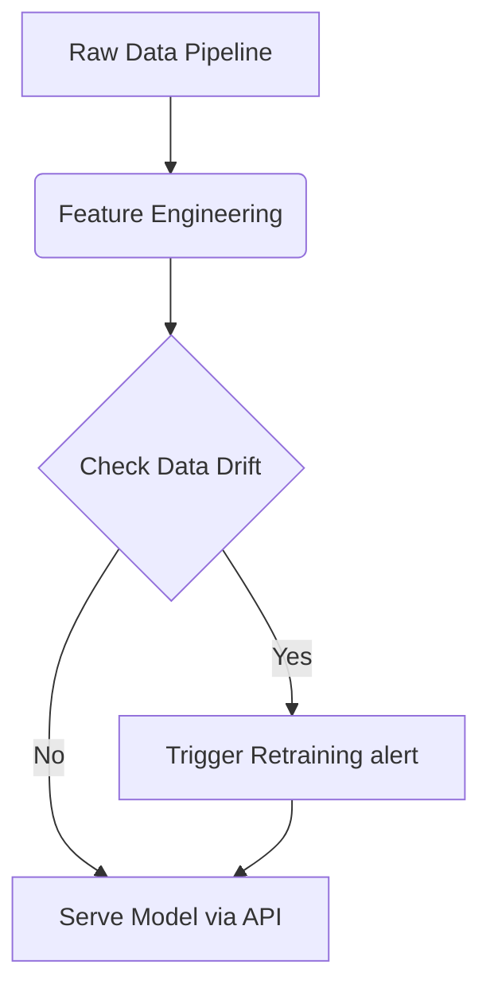

# Automated Markdown Workflow Example
**Date:** April 2026 | **Category:** System Design  
**Author:** Vamsy Vrishank

This is an example of writing purely in **Markdown** (`.md`). You no longer have to worry about writing `<h2>`, `<p>`, or `<strong>` HTML tags manually!

## How It Works
When you click on the link for this post, you are actually opening `template.html?post=example-post`.
The template intercepts the URL parameter, automatically searches for `example-post.md`, reads the file, formats it, and displays it in your browser instantly.

## Images and Media
You can easily link to images by copy-pasting the standard markdown syntax: 

```markdown

```

## Code Snippets
Code highlighting is built-in automatically. Just use standard triple backticks!

```python
import numpy as np

def calculate_portfolio_variance(weights, cov_matrix):
    """Calculates the variance of a financial portfolio."""
    return np.dot(weights.T, np.dot(cov_matrix, weights))

print("Markdown handles Python code like magic!")
```

## Flow Diagrams (Mermaid.js)
You mentioned wanting to use flow diagrams? You can use **Mermaid** directly inside this markdown file! By creating a code block and labeling the language as `mermaid`, it gets rendered into a highly readable diagram directly on the webpage.



### Next Steps:
1. Try editing this file (`example-post.md`) and saving it.
2. Refresh the browser.
3. You will see the changes instantly—**no HTML necessary!**
